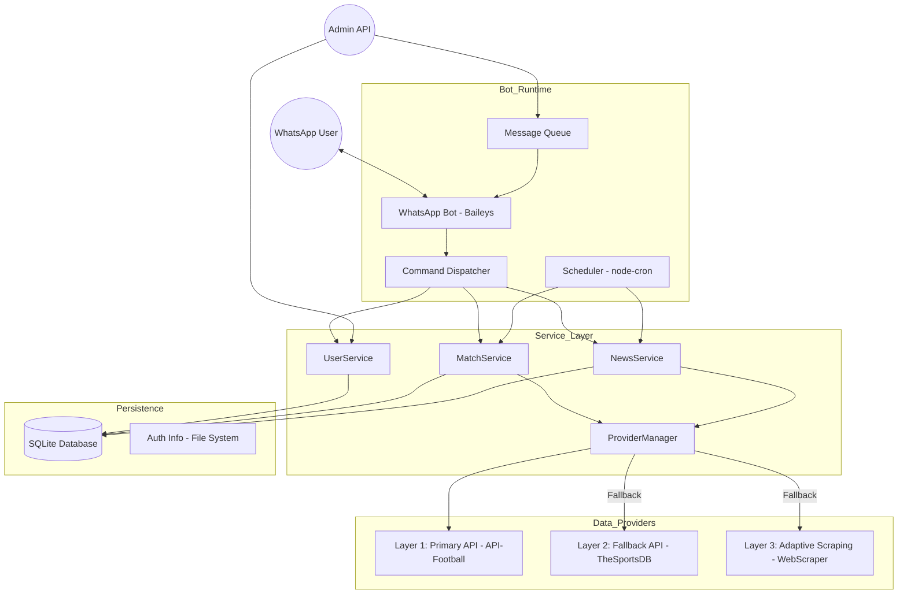

# Architecture Documentation

## Architecture Diagram

## ADR 1: Multi-Layer Provider Strategy
- **Status:** Accepted
- **Context:** Sports APIs can be unstable or hit rate limits during major events.
- **Decision:** Implement a three-layer provider system.
- **Consequences:** Higher reliability, slightly more complex code to maintain the scraping layer.

## ADR 2: SQLite for Persistence
- **Status:** Accepted
- **Context:** Need local storage on a single machine without Docker.
- **Decision:** Use SQLite for user, match, and subscription data.
- **Consequences:** Zero-configuration setup, file-based portability.

## ADR 3: Baileys for WhatsApp Integration
- **Status:** Accepted
- **Context:** Easiest to integrate into a Node.js project without requiring a separate service.
- **Decision:** Use `@whiskeysockets/baileys`.
- **Consequences:** Native Node.js implementation, low overhead.

## ADR 4: Message Queueing for Large Subscriber Base
- **Status:** Accepted
- **Context:** Sending messages to 10,000+ users can trigger WhatsApp bans if too fast.
- **Decision:** Implement a persistent-in-memory queue with rate limiting and retries.
- **Consequences:** Prevents bans, ensures message delivery even if the connection fluctuates.
